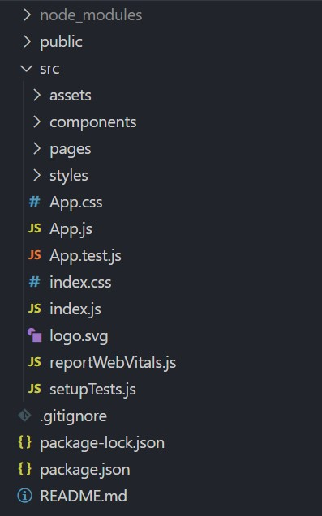

# React Introductory

[React Official](https://reactjs.org/) | [React Github](https://github.com/facebook/react/)

This document aims to provide you a quick informative introduction towards React. Hopefully by learning to appreciate and understanding React as a whole, this will help you get started on practical applications quicker.

## Why React

React is one of the modern frontend library that has grown popularity recently. Many developers has picked up this library for a multitude of reasons

1. Reusable components throughout your application

    React components is a powerful capability to take advantage of. 
    Each component are like independent pieces of code that has its own rendering logic.  
    This allows you to take advantage of abstraction, also simplifying development cycles.

2. High Performance through Virtual DOM

    A virtual representation of the UI is kept in memory through ReactDOM. By comparing previou states, it updates only the neccessary parts of the real DOM to minimise reads/writes, boosting performance compared to traditional web applications.
    [Official React Doc](https://reactjs.org/docs/faq-internals.html)  

3. Many supporting libraries available

    Due to the popularity of React, many 3rd party libraries exists to achieves certain use cases easily.  
    While some may like this flexiblity, some may prefer frameworks that provides such capabilities out of the box.

    Here are just some examples,

    |Use Cases|Available Libraries|
    |-:|:-|
    |State Management | **Redux**, Recoil, Mobx |
    |Mobile Development | React Native |
    |Components / UI | Tailwind UI, React Bootstrap, **Blueprint** |
    |Forms | React Hook Form, Formik, React Final Form |

    _Bolded libraries are used in Source Academy_

4. Growing community as React gains popularity

## What is React

As mentioned, React is a frontend JavaScript library developed **building user interfaces** .

It is `declarative-based`, where you describe the final state of the UI you desire and React is responsible for determining the necessary changes to achieve that goal. [Read More](https://ui.dev/imperative-vs-declarative-programming)

It is `unopiniated` or flexible in a sense, it leaves the build and structure of the application to you. Every react project can look different in file structure or organisation, there is **no one right way**. 
Hence, we will be discussing what Source Academy's organisation is later onwards.

## React's Project Organisation

 
> _The project in this picture was freshly created for demonstration purposes, the folders in _src/_ were manually created._

React does not impose on a specific folder structure, hence any react project can look different. This project in the image above only shows one typical style of managing your codebase.

Let's look into what some of the individual files/folders are for

#### Base
| File / Folder | Description |
| -:|:- |
| node_modules | installed packages |
| public/ | |
| src/ | Actual codebase that renders your UI |
| .gitignore | Used for Git |
| package-lock.json | Used by NPM |
| package.json | Used by NPM / Yarn |
| README.md | Guide to your codebase / application |

#### src/
| File / Folder | Description |
| -:|:- |
| assets/ | media files (etc. images, icons)|
| components/ | react components|
| pages/ | pages which users navigate between |
| styles/ | stylesheets (CSS, SCSS, ...) |
| App.css | |
| App.js  | Entry point of application |
| index.css | |
| _..others_ | |

With other use cases and libraries, more folders may/should be created for better organisation. Once again, the organisation is up to you to decide best for your development purposes.

## React Components

React components is a core building block for React applications. They are like blueprints, allowing you to create similar or same objects when they are needed anywhere in your application.

For an example, a chess board would have multiple rook pieces. A rook piece component could be created where its states and render logic is **defined once**, and then **called or created multiple times** when the board is rendered.

Taking it a notch further, we could define an abstract class for a general chess board piece instead. Then, depending on your preference, you could create separate components for each unique pieces (rook, queen, king) that inherit this piece component. Or, the piece component itself has properties that defines the type of piece. Many other implementations are possible as well!

## React Router

## Redux

## Closing

This was a quick introduction to React, more of an informative one to get you started on understanding and appreciating React applications as a whole. We have also provided a practical attempt, many practical tutorials also exist on the internet. 