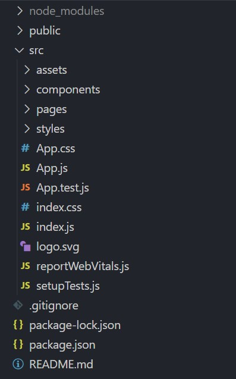

# React Introductory

[React Official](https://reactjs.org/) | [React Github](https://github.com/facebook/react/)

This document aims to provide you a quick informative introduction towards React. Hopefully by learning to appreciate and understanding React as a whole, this will help you get started on practical applications quicker.

## Why React

React is one of the modern frontend library that has grown popularity recently. Many developers has picked up this library for a multitude of reasons

1. Reusable components throughout your application

    React components is a powerful capability to take advantage of. 
    Each component are like independent pieces of code that has its own rendering logic.  
    This allows you to take advantage of abstraction, also simplifying development cycles.

2. High Performance through Virtual DOM

    A virtual representation of the UI is kept in memory through ReactDOM. By comparing previous states, it updates only the neccessary parts of the real DOM to minimise reads/writes, boosting performance compared to traditional web applications.
    [Official React Doc](https://reactjs.org/docs/faq-internals.html)  

3. Many supporting libraries available

    Due to the popularity of React, many 3rd party libraries exists to achieves certain use cases easily.  
    While some may like this flexiblity, some may prefer frameworks that provides such capabilities out of the box.

    Here are just some examples,

    |Use Cases|Available Libraries|
    |-:|:-|
    |State Management | **Redux**, Recoil, Mobx |
    |Mobile Development | React Native |
    |Components / UI | Tailwind UI, React Bootstrap, **Blueprint** |
    |Forms | React Hook Form, Formik, React Final Form |

    _Bolded libraries are used in Source Academy_

4. Growing community as React gains popularity


## What is React

As mentioned, React is a frontend JavaScript library developed **building user interfaces** .

It is `declarative`, where you describe the final state of the UI you desire and React is responsible for determining the necessary changes to achieve that goal. [Read More](https://ui.dev/imperative-vs-declarative-programming)

It is `unopiniated` or flexible in a sense, it leaves the build and structure of the application to you. Every react project can look different in file structure or organisation, there is **no one right way**. 
Hence, we will be discussing what Source Academy's organisation is later onwards.

## React's Project Organisation

<br />
> _The project in this picture was freshly created for demonstration purposes, the folders in _src/_ were manually created._

React does not impose on a specific folder structure, hence any react project can look different. This project in the image above only shows one typical style of managing your codebase.

Let's look into what some of the individual files/folders are for

#### Base Structure
| File / Folder | Description |
| -:|:- |
| node_modules | installed packages |
| public/ | |
| src/ | Actual codebase that renders your UI |
| .gitignore | Used for Git |
| package-lock.json | Used by NPM |
| package.json | Used by NPM / Yarn |
| README.md | Guide to your codebase / application |

#### src/ Structure
| File / Folder | Description |
| -:|:- |
| assets/ | media files (etc. images, icons)|
| components/ | react components|
| pages/ | pages which users navigate between |
| styles/ | stylesheets (CSS, SCSS, ...) |
| App.js  | Top-level React component |
| App.css | |
| index.js | Entry point of application |
| index.css | |
| _..others_ | |

With other use cases and libraries, more folders may/should be created for better organisation. Once again, the organisation is up to you to decide best for your development purposes.

## React Components

React components is a core building block for React applications. They are like blueprints, allowing you to create similar or same objects when they are needed anywhere in your application.

### A Practical Application
For an example, a chess board would have multiple rook pieces. A rook piece component could be created where its states and render logic is **defined once**, and then **called or created multiple times** when the board is rendered.

Taking it a notch further, we could define an abstract class for a general chess board piece instead. Then, depending on your preference, you could create separate components for each unique pieces (rook, queen, king) that inherit this piece component. Or, the piece component itself has properties that defines the type of piece. Many other implementations are possible as well!

### Functional VS Class Components

There are primarily two types of components: Functional and Class components.

**Functional Components** are basically functions that returns a JSX or React element. 
```javascript
function AnExampleFunctionComponent(props) {
  return <p>Welcome to {props.website_name}</p>;
}
```

**Class Components** are ES6 classes that extends upon React component class which has a `render()` method that returns a JSX.
```javascript
class AnExampleClassComponent extends React.Component {
  render() {
    return <p>Welcome to {props.website_name}</p>;
  }
}
```

Before `React Hooks` were introduced, class components were the only option for stateful components. However, hooks now allow functional components to utilise React functionalities that class components had. 

Furthermore, official React docs seem to `prefer functional components` as hooks can be abstracted out and shared between components! [Read More](https://reactjs.org/docs/hooks-intro.html)

## React Router
> React Router has changed syntax greatly over major updates. Following Source Academy, we will use 5.2.1 here.  
> The syntax used below is most likely outdated if newer major versions of React Router are used.

Using React Router, we can perform `client-side routing` to provide a better user experience. A typical page load will lead to white screen flash due to the browser loading a new page from the server. React Router can prevent this by only reloading the necessary components as a new page is requested within your application.

Using React Router does not break typical browser functionalities such as refresh and going backward / forward.

### Client-Side Routing

#### Pros
- Routing between components/pages are more likely to be quicker
- Animations and transitions between pages
- Does not incur a browser refresh (white screen flash)

#### Cons
- Initial loading time is large, the whole website is loaded on initialisation (Code-splitting can circumvent this issue)
- Routing logic may be cumbersome to maintain
- Search engine crawling algorithms may not pick up site contents well

Server-side routing seems to be possible with 3rd party libraries, do explore these options if necessary when building your application.


## Redux

Redux is a library that assists in managing and updating global application state, using events called 'actions'. It serves as a centralized store for state that needs to be used across your entire application, with rules ensuring that the state can only be updated in a predictable fashion.

### Why?

Class/Functional components can have states of their own, so what’s the point? Certain states are passed down from parent to children, and possibly **propagated deeply**. The codebase can grow increasingly unreadable / clunky.

Imagine building a website that manages the characters in Star Wars Universe and you are logged in as Darth Vader. 

<br />

Only Darth Vader is allowed to edit his own information, hence the table cell component needs to know the _state of the currently logged in user_. In vanilla React, you need to propogate this information down from the top level App component, down its children, eventually passing this state to the table cell.

<br />

Imagine passing implementation role based permissions, codebase gets complicated or clunky quickly with numerous states passing down (eg. user, isAdmin, isOwner, isFactionLeader, ...). 

Therefore, Redux enters the scene and introduces a _store that is accessible from any component_, removing the need for propogation in this case.

Now, states can be managed throughout your app by propogation or through the Redux store. However, there are tradeoffs to using Redux - extra dependency, more boilerplate code and more code to maintain/test are just a few of the considerations to be made. [Read More](https://redux.js.org/faq/general#when-should-i-use-redux)

## Closing

This was a quick introduction to React, more of an informative one to get you started on understanding and appreciating React applications as a whole. We have also provided a practical attempt, many practical tutorials also exist on the internet. 